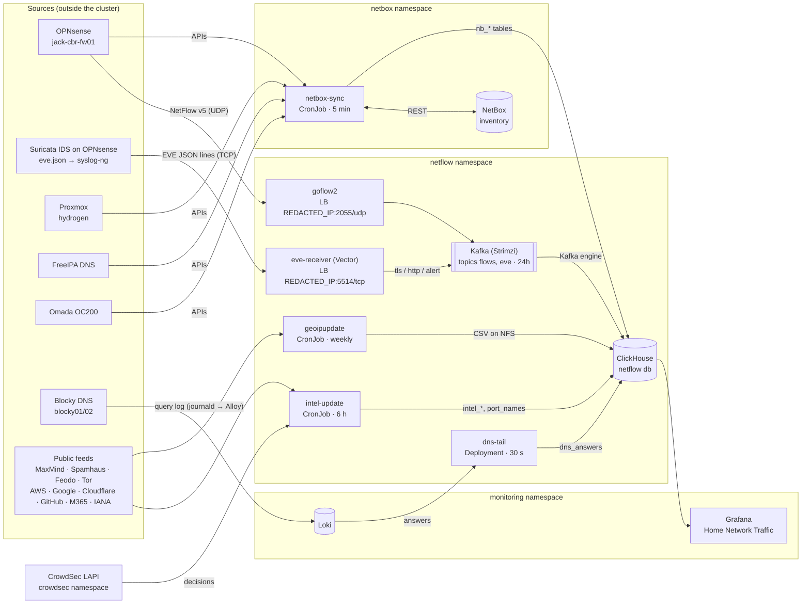
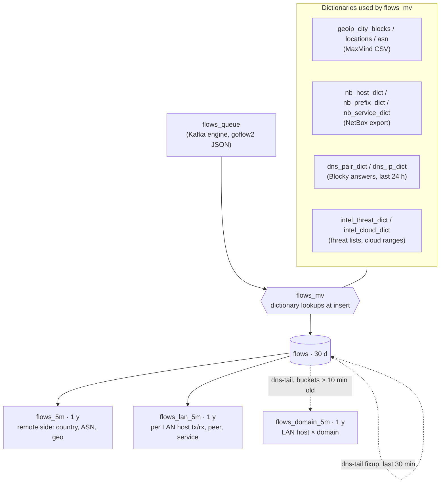

# Network monitoring (NetFlow)

Records every flow that OPNsense routes. Each flow is stored in ClickHouse and enriched when it arrives with four things:

- **Location and network owner:** where the internet end is and who runs it (GeoIP, ASN).
- **The local host:** what the LAN end is, taken from NetBox. NetBox is kept current from OPNsense, Proxmox, Kubernetes, FreeIPA and Omada.
- **The domain:** the server name Suricata saw on the wire (TLS SNI, HTTP Host), or else which name the device looked up, from Blocky's DNS answers.
- **Reputation:** the cloud service or threat list the remote address belongs to.

Grafana's **Home Network Traffic** dashboard (uid `opnsense-netflow`) is the front end. Click any local host or IP there to open **Host Traffic** (uid `netflow-host`) for that address. It shows:
- identity from NetBox
- internet and LAN totals and throughput
- domains, remote networks and a map
- LAN peers, which link on to their own page
- services it uses and serves
- its DNS lookups
- findings: threat lists, external DNS, and reset-only connections to local services
- what Suricata saw: server names (TLS/HTTP), TLS client fingerprints (JA4), IDS alerts
- recent flows



## How a flow gets enriched



| Column(s) on `flows` | Source | Meaning |
|---|---|---|
| `src/dst_country`, `_city`, `_lat/_lon`, `_asn`, `_as_org` | MaxMind GeoLite2 (IP_TRIE) | Where the internet end is and who owns it. Private addresses stay empty. |
| `src/dst_host`, `_host_kind` | NetBox → `nb_hosts` | Name and kind (`client`, `vm`, `k8s-node`, `k8s-vip`, `vip`, …) |
| `src/dst_segment` | NetBox prefixes → `nb_prefixes` | `users`, `kubernetes`, `cctv`, …, `Asher CBR`/`Asher MEL` (remote sites, prefixes from homelab-tf), or `internet` |
| (query time) `via` | OPNsense interface routes → `nb_prefixes.via` | The interface a prefix is reached over when it isn't a local VLAN, e.g. `INTER_WG_TO_CBR (wg1)` for the remote sites (the peers' AllowedIPs). Dashboards look it up with `dictGet('netflow.nb_prefix_dict', 'via', …)`; it isn't stored on flows. |
| `service` | NetBox services → `nb_services` | e.g. `traefik/traefik websecure`, `frigate`. Matched on dst:port, or src:port for return traffic. |
| `domain`, `domain_names` | Blocky answers → `dns_answers` → `conn_domains` | The name the client looked up to reach the server, chosen once per connection (see below). `domain_names` counts the names the client had for that IP: 1 means certain, more than 1 means a best guess. Works for LAN VIPs too: `REDACTED_IP` resolves to `cctv.0b.au` etc. |
| `remote_cloud` | Published ranges → `intel_cloud` | e.g. `AWS CLOUDFRONT ap-southeast-2`, `GitHub pages`, `Microsoft 365 Exchange` |
| `threat` | Threat lists → `intel_threat` | `spamhaus-drop`, `feodo`, `tor-exit`, `crowdsec` |

### How a flow gets its domain

0. **Seen on the wire (certain):** Suricata on OPNsense logs the server name of every TLS handshake (SNI) and plaintext HTTP request (Host). `05-eve.sql` writes each one straight into `conn_domains` for that connection with `names = 1` and `source = 'sni'`/`'http'`. This covers DNS-over-HTTPS, cached and hard-coded IPs, shared IPs and simultaneous lookups. The steps below fill in what it doesn't see: other protocols, QUIC (HTTP/3), and VLANs Suricata doesn't listen on.
1. **Answers:** dns-tail stores every A record Blocky answers as `(time, client, ip, name)`. Blocked names (`REDACTED_IP`) are skipped.
2. **Provisional label at insert:** a flow first gets the client's *latest* name for the server IP, from `dns_pair_dict`. If the client never looked the IP up, it falls back to anyone's latest name for it (`dns_ip_dict`).
3. **Per-connection assignment:** every 2 minutes dns-tail assigns each new connection that Suricata didn't already name `(client, port, server, port, proto)` one name: the client's lookup of that IP **at or just before the connection started** (an ASOF join with 5s slack). The result goes in `conn_domains`. The fixup relabels the connection's flows with it, and later records of the same connection get it straight from `conn_domain_dict` at insert. A long stream therefore keeps the name it was opened with, even when the device looks up other names on the same IP meanwhile.

It's still a best guess wherever one IP carries several names:
- **Several lookups right before a connection:** e.g. Flux resolving several GitHub Pages-hosted Helm repos within a second of each other.
- **HTTP/2 connection reuse:** browsers reuse one connection for several names under the same certificate (`*.0b.au`), so a single connection genuinely carries several sites.

`domain_names > 1` marks these cases. The dashboards show `name (1 of N)` and a *certain* share. For TLS and HTTP, step 0 settles them; `conn_domain_dict` always prefers a `source` other than `dns`. HTTP/2 reuse remains: the SNI names the connection's first site only.

Enrichment happens **once, at insert**. A row keeps the names that were true when it arrived. Two things work around that:
- **`domain` fixup:** dns-tail relabels the last 30 minutes of flows every 2 minutes, using per-connection names, which also covers flows that arrived before their DNS answer.
- **Names on dashboards:** panels group LAN devices by IP and label them with the host's *current* NetBox name, so a renamed device stays one row. The name stored at ingest is only the fallback for addresses NetBox no longer has. The `peer` column of `flows_lan_5m` still holds LAN peers' names as they were at ingest.

## Components

| Component | Where | What it does |
|---|---|---|
| OPNsense NetFlow export | firewall | v5 to `REDACTED_IP:2055/udp`. v5 has no IPv6 (none is used). |
| goflow2 | `goflow2-deployment.yaml` | Decodes NetFlow and produces JSON to Kafka topic `flows` |
| Kafka | `kafka/` (Strimzi, KRaft, 1 node) | 24h buffer. ClickHouse can be down or its MV rebuilt without losing flows. |
| Suricata (OPNsense IDS) | firewall, configured by hand (see [Suricata](#suricata)) | Logs TLS handshakes, HTTP requests and alerts to `eve.json`. syslog-ng streams the lines over TCP using `eve/opnsense-syslog-ng.conf` |
| eve-receiver | `eve/receiver.yaml`, `eve/vector.yaml` | Vector: keeps tls/http/alert events, flattens them, drops the duplicate copy of traffic between two monitored VLANs, and produces to Kafka topic `eve`. Nothing goes to Loki |
| ClickHouse | `clickhouse/` (Altinity operator, 1 replica) | Storage, dictionaries, rollups. Schema in `clickhouse/schema/*.sql`, applied by `schema-job.yaml`. |
| geoipupdate | `geoip-cronjob.yaml` | Weekly MaxMind GeoLite2 City + ASN CSVs on the `geoip-db` NFS PVC |
| dns-tail | `enrich/dns_tail.py`, `enrich/dns-tail.yaml` | Blocky query log from Loki into `dns_answers`, plus the domain fixup and the `flows_domain_5m` rollup |
| intel-update | `enrich/intel_update.py`, `enrich/intel-update.yaml` | Every 6h: threat lists, cloud ranges and IANA port names into `intel_*` / `port_names` |
| netbox-sync | [`apps/infra/applications/netbox/sync/`](../../../../apps/infra/applications/netbox/sync) | Every 5 min: OPNsense + Proxmox + Kubernetes + FreeIPA + Omada into NetBox, then NetBox into `nb_*` |
| Dashboards | `dashboard/gen.py`, `dashboard/gen_host.py`, `dashboard/gen_health.py` | Generate the Grafana dashboard JSON for *Home Network Traffic*, *Host Traffic* and *NetFlow Pipeline* (pushed with gcx, not GitOps) |
| Metrics | `scrapes.yaml`, `kafka/metrics.yaml` | VictoriaMetrics scrapes: Kafka broker JMX + Kafka Exporter (consumer lag), goflow2, dns-tail. ClickHouse comes from the clickhouse-operator's metrics-exporter; intel-update pushes its per-feed results to vmagent |

### netbox-sync

Every run has five steps:
1. **Collect** from each source.
2. **Merge** into one set of hosts, keyed by MAC with IP as the fallback.
3. **Bootstrap** the NetBox scaffolding: tags, custom fields, roles.
4. **Reconcile:** diff against NetBox and write only what changed.
5. **Export** NetBox, as it now is, into ClickHouse.

What each source contributes:

| Source | Endpoint | Contributes |
|---|---|---|
| OPNsense | `https://REDACTED_IP` API (k8s nodes can't reach NET_MGMT REDACTED_IP) | ARP (presence), dnsmasq leases, static hosts and DHCP pools, Unbound overrides, VLANs, prefixes, firewall interfaces |
| Proxmox | `https://REDACTED_IP:8006` | Node and PVE version, the node's NICs/bonds/bridges/VLAN interfaces, VMs with guest-agent IPs, OS, NIC VLANs, disks and tags. Extra `/32`s on a VM are keepalived VIPs, named via `VIP_NAMES` (`dns`). |
| Kubernetes | in-cluster SA | Nodes and their OS, LoadBalancer VIPs (FHRP groups + one Service per port, listing Traefik's hosts) and the Cilium pools they come from, selector-less `external-service-*` backends |
| Metrics | VictoriaMetrics (vmselect, tenant 0) | Physical hosts' make, model, SKU and serial (`node_dmi_info`), and their real NIC names and MACs (burned-in MAC with a link speed) |
| Wazuh | indexer `wazuh.internal:9200`, read-only user `grafana` | Each agent's listening ports (by process), OS and board serial |
| Frigate | `https://REDACTED_IP:8971/api/config` (auth off; nftables admits only the k8s range) | Camera names for camera IPs (from go2rtc stream sources) |
| BMC | Redfish on `BMC_HOSTS` (hydrogen's iLO 4, read-only login) | DIMMs, PSUs, BIOS/iLO firmware; marks the BMC's own port out-of-band |
| Home Assistant | websocket API `http://REDACTED_IP:8123` (non-admin user's token) | Names people gave devices, make/model, firmware, room (area); Zigbee/Bluetooth devices |
| Binary Lane | `api.binarylane.com.au` (garage's token) | VPSes (edge01) as cloud VMs |
| FreeIPA | `ipa01` JSON-RPC | Forward A records as a naming fallback (reverse zones aren't populated) |
| NetFlow | ClickHouse `netflow.flows`, hourly | Ports LAN hosts answer on (see *Services seen in NetFlow*) |
| Omada | `https://REDACTED_IP` OpenAPI + web API | Client names (a fallback, see below), its switches and APs (names, switch ports, topology), where each client connects (see *Physical connections*). The web API (the omada-exporter's login) adds live port state and AP uplink ports; it's optional. |

**Naming precedence**, first match wins:
1. Proxmox VM name
2. k8s node
3. OPNsense static host / Unbound override
4. A name someone gave the device in Home Assistant (`Christmas-Tree`)
5. Frigate camera name (`garage-door`)
6. Omada device name, for Omada's own switches and APs (`Lounge-Room-AP`, or `<model>-<mac tail>` while Omada still shows the MAC)
7. k8s external-service
8. IPA record
9. DHCP hostname
10. Home Assistant's own device name (`SHIELD-Android-TV`)
11. Omada hostname
12. Omada client name
13. `client-<mac tail>`

Omada's client name ranks last because it's rarely an alias. Unless someone renames the client in the controller, Omada stores the first name it detected and never updates it: both iPhones are `iPhone`, every camera is `Camera1`, and k8s-node-3 is `DESKTOP-BFN4IFK`. The OpenAPI can't tell the two apart. Names that still clash get the MAC tail appended (`iPhone-45a3`). Omada's switches and APs rank above DHCP because their DHCP hostname is only the model (`SG2210P`); they get host kind `network` and the `Network` device role.

**Physical connections** (from Omada's active clients):
- **Switches** get an interface per port, `1/0/<n>`. A port's Omada name (`Router Uplink`, `ILO`) becomes its label, and its profile goes in the description. Ports with the `Disable` profile are disabled.
- **Wired devices** get a cable from the interface carrying the MAC Omada saw to that switch port. This includes the firewall (`ix1` to SG3428 port 1), hydrogen and the k8s nodes.
- **Shared ports** get no cable: when two NetBox devices sit on one port, there's an unmanaged switch in between (jp-desktop behind the TL-SG105MPE on port 16). VMs share their hypervisor's port and don't count.
- **Wi-Fi devices** get a `wlan0` interface of the right 802.11 type (`rf_role` station), made a member of the SSID's wireless LAN. Each SSID is a NetBox wireless LAN, linked to its VLAN. The AP and band go in the interface description. NetBox wireless links are point-to-point, one per interface, so AP-to-client links aren't drawn.
- **APs** get `radio0`/`radio1` interfaces (`rf_role` ap) in every SSID, and a cable from `eth0` to their switch port. The port comes from the switch's `downlinkList` in the web API; the OpenAPI only names the switch.
- **Switch-to-switch uplinks** are cabled port to port (SG3428 `1/0/3` to the SG2210P's `1/0/8`), from the OpenAPI v2 `topology` endpoint, which gives the port at both ends.
- **Link speed:** each switch port gets its negotiated `speed` and `duplex` from the web API, cleared while the link is down, and so does the device interface cabled to it. The interface type stays what the port can do (`1000base-t`, `1000base-x-sfp` for SFP ports), so a gigabit port that negotiated 100M, like the JetKVM's, shows both. Without the web API, the speeds and types already in NetBox are kept.
- **The `connection` custom field** stays as a one-line summary, using the switch's or AP's NetBox name.
- **Hand-made cables win:** the sync only moves or deletes cables tagged `netbox-sync`. A cable you draw yourself on either end is left alone, along with that link. Inactive clients keep their last cable.

- **Switch ports carry their VLANs** from the Omada port profile:
  - A profile with every network becomes `tagged-all`, and one with some tagged networks becomes `tagged`.
  - Anything else becomes `access`, and so does the interface of a wired device on that port.
  - Omada's default VLAN 1 isn't in NetBox, so it's left out.

**Other enrichment:**
- **Platforms:** VMs get one from the guest agent's OS (`Debian 13`, `Fedora 44`), k8s nodes from their OS image, and hydrogen gets `Proxmox VE 9.2`.
- **VM placement:** every VM is placed on its Proxmox node's device. To allow that, hydrogen is put in the `pve-jack-cbr` cluster.
- **Omada switches and APs:** they get a TP-Link device type per model (`SG3428`), their serial number, and a `firmware` custom field.
- **DHCP pools:** OPNsense's dnsmasq pools become IP ranges ("DHCP pool, Users"), marked populated so their addresses don't show as free. A pool overlapping a range someone else made, such as Terraform's `ip_ranges.tf`, is skipped.
- **IP status:** addresses in a pool get status `dhcp`, unless a dnsmasq static host or Unbound override covers them.
- **Interface structure:**
  - Hypervisors get their real NICs, bonds (`lag`), bridges (`bridge`) and VLAN interfaces (`virtual`, with `parent` and an access VLAN). A NIC links to its bond or bridge through `lag`/`bridge`. The Omada cable goes on the physical NIC beneath the bridge, not on `vmbr0`.
  - The firewall's VLAN sub-interfaces get their trunk NIC as `parent` and their VLAN as access. The trunk gets them all as `tagged`, and the shared MAC sits on the trunk.
  - VM interfaces get `access` mode in their Proxmox `tag`'s VLAN, or else in the VLAN of the bridge they're on, when that bridge is built on a VLAN interface.
  - These fields are only set on interfaces tagged `netbox-sync`.
- **keepalived VIPs:** each `vip <ip>` FHRP group is assigned to the VM interface holding the address right now (keepalived's MASTER), and follows it on failover.
- **VM disks and tags:** Proxmox disks become virtual disks (`scsi0`, `rootfs`, `mp0`, with the storage in the description), so NetBox totals the VM's disk itself. Proxmox tags become `pve-<tag>` NetBox tags, and they're removed when removed in Proxmox.
- **Hardware:** physical hosts with node metrics (hydrogen, nvr, the k8s nodes) get a real device type, e.g. `HP ProLiant ML110 Gen9` with part number `776935-B21`, and their serial. The DMI vendor becomes the manufacturer (`Dell Inc.` → `Dell`). QEMU guests are left to Proxmox. Their NICs get real names (`eno2`); a guessed `eth0` is renamed, keeping its cable and IPs. On hydrogen, the MACs move from the bridges to `eno1`/`eno2`.
- **k8s LoadBalancer pools:** each Cilium pool block becomes an IP range ("k8s LoadBalancer pool infranet"), tagged `sync-k8s` and marked populated like the DHCP pools.
- **Parts (inventory items):** hydrogen's disks (model, serial, size, SMART, wearout; matched by serial), CPU and NIC/storage cards from Proxmox; its DIMMs and PSUs from the iLO; Zigbee/Bluetooth devices from Home Assistant on their coordinator (or the HA host). Each source only changes or removes the items it made.
- **Services from Wazuh:** each agent's listening ports, grouped by process (`blocky`: tcp+udp/53, tcp/4000), tagged `sync-wazuh`. They cover the NetFlow guesses for those ports. A dual-boot box's other-OS agent (same IP, different name) is ignored.
- **Cameras:** Frigate's names, the `Camera` role.
- **Rooms:** a Home Assistant area fills an empty NetBox location; a room set by hand wins.
- **OPNsense extras:** WAN port forwards as services on the firewall bound to the WAN address, whose `nat_inside` points at the one host behind them (if only one); remote-access WireGuard peers (`WG`) as their tunnel addresses with the last handshake as `last_seen` (active within 7 days, else deprecated); gateways as described IPs. The inter-site WireGuard mesh stays Terraform's.
- **Cloud VMs:** Binary Lane servers in a `Binary Lane <region>` cluster (type Cloud), public addresses on `eth0`, private on `eth1`; the WireGuard peer connecting from its public address gets its tunnel address on `wg0`.
- **DNS (netbox-dns plugin):** FreeIPA's zones with its SOA/nameserver. The LAN prefixes are in the default view, so DNSsync makes A/AAAA records linked to each IP from its `dns_name` (and PTRs in the reverse zones); IPA's other records (alias A such as the ingress names, CNAME, SRV, MX) are mirrored as plain records, aliases without PTR. FreeIPA-enrolled hosts get the `ipa-enrolled` tag.
- **Tenancy and grouping:** objects the sync makes get the site's tenant. VLANs it creates go in the site's VLAN group (Terraform's, slug = site slug). Physical k8s nodes are put in the `k8s-jack-cbr` cluster (type Kubernetes, env `K8S_CLUSTER`).

**Services seen in NetFlow.** Every hour, netbox-sync looks for LAN addresses that answer from one fixed port (below 32768) to at least 5 different client ports over the last 7 days. That pattern is a server, and the opposite pattern is a client.
- **Where it goes:** each match becomes a NetBox service on the device, VM or VIP owning the address, named by IANA (`https`, `ldaps`, `proxmox`). Ports under the same name on one host share a service (`domain` = tcp+udp/53).
- **Tags:** it's tagged `sync-flows`.
- **Skipped:** ports a Kubernetes or hand-made service already covers.
- **Removed:** a service that drops out of the 7-day window.
- **What it can't see:** only routed (inter-VLAN) traffic reaches NetFlow, so a service used only within its own VLAN isn't found.
- **Curating:** to rename or keep one, remove its `sync-flows` tag. It then counts as hand-made: it covers its ports, and the sync leaves it alone.

The export puts these services in `nb_services`, so new flows get them in their `service` column.

**Rules the sync follows:**
- **Ownership:** everything it creates is tagged `netbox-sync`. It never changes or deletes untagged objects, apart from filling empty prefix descriptions and VLAN links.
- **Your edits win:** tag an object `sync-locked` and the sync won't change its name, description or DNS name.
- **Ageing:** clients unseen for 7 days go `offline` and are deleted after 30. VMs and hypervisors are only ever marked, never deleted.
- **Source outages:** a source that fails a run ages nothing out, and doesn't rename or untag anything it owns.

## Data and retention

| Table | Retention | Notes |
|---|---|---|
| Kafka topic `flows` | 24h / 5 GiB | Buffer only. goflow2 produces zstd (~10× smaller than raw JSON) |
| Kafka topic `eve` | 24h / 1 GiB | Buffer only (Vector, zstd) |
| `eve_tls`, `eve_http`, `eve_alert` | 30 days | Suricata events, with NetBox names and ASN added at insert |
| `flows` | 30 days | One row per flow, all enrichment columns |
| `flows_5m`, `flows_lan_5m`, `flows_domain_5m` | 1 year | Rollups; dashboard panels use these for long ranges |
| `dns_answers` | 30 days | Domain dictionaries only look at the last 24h |
| `nb_*`, `intel_*`, `port_names` | replaced each refresh | Filled as `<t>_new`, then `EXCHANGE TABLES`, so dictionaries never see a half-written table |
| ClickHouse `system.*_log` | 7 days | Its own query/trace/metric logs. Set in `chi.yaml` (`config.d/system_logs.xml`); several default to never expiring |

Footprint at ~2.7M flows/day (measured on the first full day, 2026-10-01: `flows` compresses to ~45 B/row):
- **ClickHouse:** ~1.5 GB for 30 days of `flows`, under 1 GB/year for the rollups, about 150 MB of DNS answers, and 1–2 GB of system logs. The Suricata tables are estimated at under 1 GB for 30 days (~200–400k events/day).
- **Kafka:** roughly 300 MB for the 24h `flows` buffer, plus under 100 MB for `eve`.
- **Longhorn:** keeps 3 replicas of each volume, so multiply by 3 for node disk.
- **RAM:** ClickHouse holds about 750 MB of dictionaries, mostly GeoIP city blocks.

## Access and credentials

| ClickHouse user | Used by | Rights |
|---|---|---|
| `admin` | schema Job, humans | Everything |
| `grafana` | Grafana datasource `clickhouse-netflow` | Read-only (`readonly=2`) |
| `netbox_sync` | netbox-sync | `netflow.nb_*` only |
| `enricher` | dns-tail, intel-update | Its own tables, `ALTER UPDATE` on `flows`, `dictGet` |

Vault (`k8s-infra` mount on `vault.internal`):

| Path | Properties |
|---|---|
| `netflow/clickhouse` | `admin_password`, `grafana_password`, `netbox_sync_password`, `enricher_password` |
| `netflow/crowdsec` | `bouncer_key` (the `netflow` CrowdSec bouncer; also read by the crowdsec namespace) |
| `netbox/sync` | `netbox_token`, `opnsense_key`, `opnsense_secret`, `ipa_user`, `ipa_password` |
| `netbox/proxbox/credentials` | Proxmox API token (`user`, `token_id`, `token_secret`, `domain`) |
| `omada-exporter/credentials` | Omada OpenAPI client (`id`, `secret`), shared with omada-exporter |
| `maxmind/credentials` | GeoLite2 download |

## Operating it

**Name something.** Rename the device in NetBox and tag it `sync-locked`, or add an OPNsense static host. An Omada alias only counts for devices that send no DHCP hostname. New flows carry the name within about 7 minutes (one sync plus a dictionary reload). The dashboard's *Unidentified hosts* panel is the to-do list.

**Change the schema.** Edit `clickhouse/schema/*.sql`. The ConfigMap hash changes, so Flux recreates the Job, which re-runs every file in order:
- New columns go in as `ALTER TABLE … ADD COLUMN IF NOT EXISTS`.
- `flows_mv` is dropped and recreated on every run. That's safe, because Kafka holds flows while no MV is attached.
- The Job can fail a few times while ClickHouse restarts: its Service is headless, so the name vanishes with the pod. It retries.

**Backfill enrichment onto old flows** after adding a new lookup:

```sql
ALTER TABLE netflow.flows UPDATE <column> = <same expression as flows_mv> WHERE 1
SETTINGS mutations_sync = 2, allow_nondeterministic_mutations = 1;
```

Then rebuild any affected rollup for the backfilled period: delete its buckets and `INSERT … SELECT` from `flows` with the rollup's query. Do this on a 5-minute bucket boundary so nothing is double-counted.

**Update the dashboard:**

```bash
cd dashboard && python3 gen.py && gcx resources push -p opnsense-netflow.json
python3 gen_host.py && gcx resources push -p netflow-host.json
python3 gen_health.py && gcx resources push -p netflow-pipeline.json
```

**Run the tests:**

```bash
# from this directory
(cd ../../../../apps/infra/applications/netbox/sync && uv run --with pytest,requests,netaddr pytest tests)
(cd enrich && uv run --no-project --with pytest,requests,prometheus-client pytest tests)
```

**Check health:** Grafana's **NetFlow Pipeline** dashboard (uid `netflow-pipeline`) covers goflow2, Kafka lag, ClickHouse table sizes and dictionaries, the enrichers, and Suricata EVE. By hand:

```bash
kubectl -n netbox logs job/$(kubectl -n netbox get jobs -o name | grep netbox-sync | tail -1 | cut -d/ -f2)   # expect writes 0/0/0
kubectl -n netflow logs deploy/dns-tail --tail=20
kubectl -n netflow exec chi-netflow-netflow-0-0-0 -- clickhouse-client -q \
  "SELECT name, status, element_count, last_exception FROM system.dictionaries WHERE database='netflow'"
kubectl -n netflow exec chi-netflow-netflow-0-0-0 -- clickhouse-client -q \
  "SELECT length(exceptions.text), num_messages_read FROM system.kafka_consumers"
```

### Suricata

Suricata runs in IDS mode on OPNsense. It only listens; it never blocks. Its `eve.json` reaches ClickHouse without going through Loki:
- syslog-ng on the firewall sends the raw lines over TCP to `REDACTED_IP:5514`
- eve-receiver keeps tls, http and alert events and produces them to the Kafka topic `eve`
- the `eve_queue` Kafka engine table feeds the `eve_*_mv` views, which write the `eve_*` tables
- `conn_domains_sni_mv` / `conn_domains_http_mv` copy the names into `conn_domains`

The firewall side is manual:
1. **Services → Intrusion Detection → Administration:**
   - Enable it. Leave IPS mode and promiscuous mode off.
   - Interfaces: the client VLANs (users, guest, WireGuard). Add `kubernetes` once firewall CPU looks fine. Leave out `legacy-services`, where the NFS traffic comes from.
   - Enable EVE TLS logging with *extended* (adds JA4) and EVE HTTP logging. Keep the logs for 1–2 days.
   - Rulesets aren't needed for names. Enable ET Open categories only if you want `eve_alert`, since rules are where the CPU goes.
2. **syslog-ng drop-in:** copy `eve/opnsense-syslog-ng.conf` to `/usr/local/etc/syslog-ng.conf.d/netflow-eve.conf`. Check it with `syslog-ng --syntax-only`, then restart the syslog service (System → Log Files → General, or `configctl syslog restart`). The file lives outside OPNsense's config, so a reinstall or factory reset loses it. Keep this repo copy current.

Check it: `tail -f /var/log/suricata/eve.json | grep '"tls"'` on the firewall, then `kubectl -n netflow logs deploy/eve-receiver` and the *Suricata EVE* row of NetFlow Pipeline.

What the OPNsense template allows: `eve.json` only carries the types the UI exposes (alert, anomaly, http, tls, drop, ssh). **QUIC (HTTP/3) and DNS events aren't available.** Adding them means overriding OPNsense's Suricata outputs list through `/usr/local/etc/suricata/conf.d/`, which merges by list index and is fragile. QUIC traffic therefore still gets its name from DNS.

## Gotchas

- **Manual sync runs can race.** Don't `kubectl create job --from=cronjob/netbox-sync` while a scheduled run is active. `concurrencyPolicy: Forbid` only covers the CronJob's own Jobs. The sync removes duplicate VIPs it finds, but a race still costs a messy run.
- **Omada is slow.** The OC200 sometimes takes over 60s. Omada calls have a 120s timeout and a retry, and a failed Omada run changes nothing.
- **Load-balancer IPs in ARP.** They appear with a k8s node's MAC, so they're excluded from MAC merging. In Omada a node's "IP" can be a VIP, so Omada is matched by MAC only.
- **Same-subnet traffic is invisible.** NetFlow only sees what OPNsense routes. Two devices on the same subnet talk through the switch, not the firewall.
- **DNS gaps.** Devices using DNS-over-HTTPS or hard-coded IPs get no `domain` unless Suricata sees a TLS SNI or HTTP Host for the connection. QUIC/HTTP3, STUN/VoIP and ECH (encrypted SNI) still go unnamed. The *DNS coverage* panel shows the matched share.
- **Suricata only sees the VLANs it listens on.** On the firewall, two monitored VLANs see the same connection twice; eve-receiver drops the second copy.
- **CrowdSec runs offline** (`DISABLE_ONLINE_API`), so the `crowdsec` threat source only holds local decisions, not the community blocklist.
